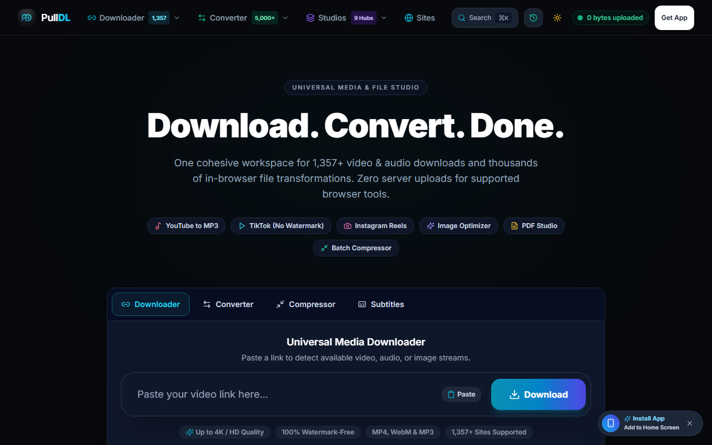
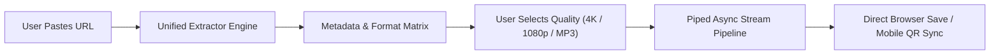

  
  <h1>PullDL — Universal Web Media Downloader & File Studio</h1>
  
<strong>Fast, zero-friction, privacy-first media downloads and format conversions from 1,350+ platforms directly on the web at <a href="https://pulldl.com">pulldl.com</a>.</strong>

  

    
    
    
    
    
    
  

  

    <a href="https://pulldl.com"><strong>Launch Web App 🚀</strong></a> •
    <a href="#-overview"><strong>Overview</strong></a> •
    <a href="#-flagship-features"><strong>Features</strong></a> •
    <a href="#-supported-platforms"><strong>Supported Sites</strong></a> •
    <a href="#-architecture--stream-pipeline"><strong>Architecture</strong></a> •
    <a href="#-privacy--security"><strong>Privacy</strong></a> •
    <a href="#-legal--trademark"><strong>Legal</strong></a>
  

   

  

---

## 🌟 Overview

**PullDL ([pulldl.com](https://pulldl.com))** is an executive, privacy-first universal web media downloader and client-side conversion studio. Designed as an ad-free, high-speed alternative to cluttered download sites and intrusive desktop software, PullDL enables users to paste any video, audio, or media URL and instantly stream or save it in pristine fidelity.

With native support for over **1,350+ streaming platforms**, intelligent adaptive stream muxing (4K/8K DASH), studio-grade 320kbps MP3 audio extraction with ID3 tagging, and real-time piped chunk streaming, PullDL delivers an elite media download experience directly inside any modern browser on desktop and mobile.

---

## ✨ Flagship Features

### ⚡ Universal 1,350+ Platform Ingestion
- Extract video and audio from YouTube, Facebook, Instagram Reels, TikTok (watermark-free), Twitter/X, Reddit, Vimeo, SoundCloud, Pinterest, Twitch, Bilibili, and 1,300+ additional sources.
- Single unified search & paste bar with automatic source detection and URL sanitization.

### 🎬 Pristine Video Muxing (Up to 8K UHD)
- Automatically resolves separated adaptive video and audio DASH streams.
- Delivers complete, universally compatible MP4 files at 4K, 2K, 1080p 60FPS, and 720p HD.
- 100% watermark-free processing for social media platforms including TikTok and Instagram.

### 🎵 High-Fidelity Audio & ID3 Metadata Engine
- 1-click conversion to studio-quality **320kbps MP3** and clean AAC/M4A.
- Automatic artist name, track title parsing, and high-resolution album artwork embedding directly into MP3 ID3v2 tags.

### 🚀 Zero-Wait Streaming Pipeline
- Real-time piped chunk streaming directly from source servers to the user's browser.
- Eliminates server storage bottlenecks and eliminates long encoding waiting screens.
- Full HTTP Range (`206 Partial Content`) support for reliable pause and resume capability.

### 📱 PWA & Mobile QR Sync
- Dynamic on-screen QR handoff: scan any resolved download on desktop with your iPhone or Android camera to instantly trigger the download in mobile Safari / Chrome.
- Installable Progressive Web App (PWA) with offline caching and home screen launch.

### 🛠️ In-Browser Client-Side File Studio
- Integrated client-side utilities including image compression, format converters, and document processing that execute 100% locally in the browser with zero server file uploads.

### 🛡️ Zero Ads, Zero Tracking, Zero Popups
- Strict privacy-first policy: no advertisements, no pop-up redirects, no cookie tracking, and zero activity logs stored.

---

## 🌐 Supported Platforms

| Platform | Supported Resolutions & Formats | Key Capabilities |
| :--- | :--- | :--- |
| **YouTube** | 8K / 4K UHD, 1440p, 1080p 60FPS, 720p, 320kbps MP3 | Shorts, Full Videos, Playlists, Clean Audio |
| **TikTok** | 1080p FHD MP4, Clean Audio MP3 | 100% Watermark-Free, Original Sound |
| **Instagram** | 1080p HD MP4, MP3 | Reels, Stories, Carousels, IGTV |
| **Facebook** | 1080p HD, 720p SD MP4 | Watch, Reels, Public Videos & Clips |
| **Twitter / X** | 1080p HD MP4, Animated GIF | Fast Tweet Media & Spaces Audio |
| **Reddit** | Muxed 1080p HD MP4 | Synchronized Audio-Video Muxing |
| **SoundCloud** | 320kbps MP3, High-Res Artwork | Full Track ID3 Tagging & Metadata |
| **Pinterest** | 1080p HD MP4 | Video Pins & Idea Pins |
| **Vimeo** | Up to 4K UHD MP4 | Original Source Quality |
| **1,340+ Others** | MP4, WebM, MP3, M4A, HLS, DASH | Universal Multi-Platform Engine |

👉 *For the complete searchable list of supported websites and extractors, visit [pulldl.com](https://pulldl.com).*

---

## 🏗️ Architecture & Stream Pipeline

PullDL utilizes an asynchronous, non-blocking streaming architecture designed for high concurrency and immediate response times:

1. **Extraction Layer:** Validates input URLs, queries extraction workers, and resolves adaptive video/audio stream manifests.
2. **Format Synthesis:** Structures available resolutions, bitrates, file sizes, and audio tracks into a clean selection card.
3. **Piped Delivery:** Streams chunks asynchronously over HTTP with proper `Content-Disposition`, bypasses disk caching for instant downloads, and serves native streams to client devices.

---

## 🔒 Privacy & Security

- **No Data Retention:** We do not log downloaded files, pasted URLs, or user IP addresses.
- **Direct Piped Streaming:** Files pass through encrypted transient memory buffers and are never retained on server storage.
- **Client-Side Processing:** All media conversion tools under the Studio tab run via WebAssembly and Web APIs inside your browser sandbox.
- **Encrypted Traffic:** All connections are enforced with TLS 1.3 / HTTPS encryption.

---

## ⚖️ Legal & Trademark

- **Trademark:** PullDL™ and the PullDL logo mark are intellectual property of **Mahean Ahmed**.
- **Fair Use:** PullDL is provided strictly for personal backup, offline viewing of user-authorized media, and educational fair use. Users are responsible for complying with the terms of service of respective media providers.
- **DMCA Compliance:** We respect copyright holders. For inquiries, takedown requests, or partnership details, please contact: **contact@mahean.com**.

---

  
© 2026 <strong>PullDL</strong>. Built with precision for the modern web.

  
<a href="https://pulldl.com"><strong>Visit pulldl.com</strong></a>

